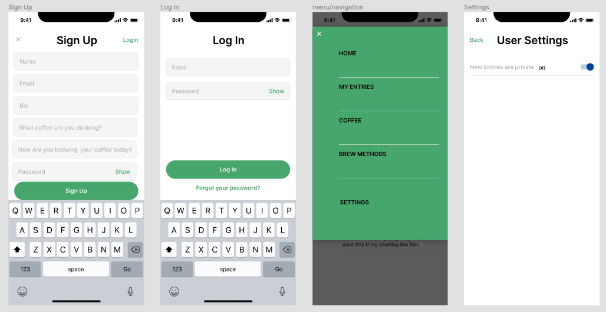
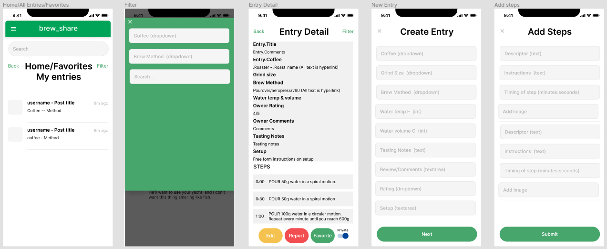
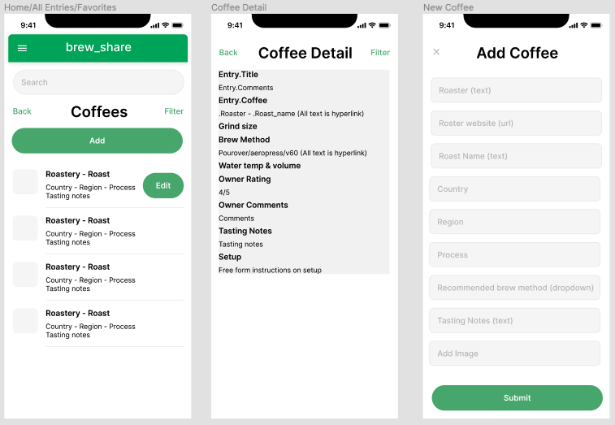
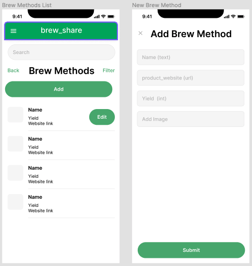
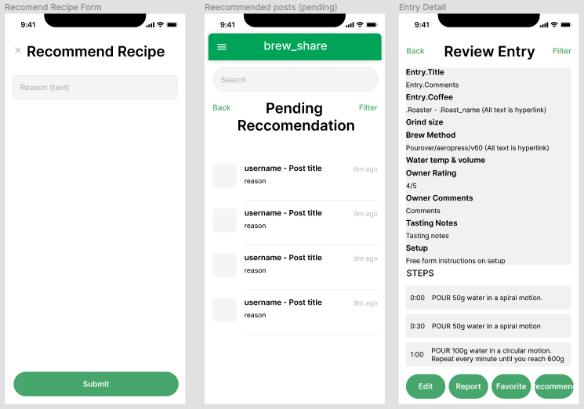
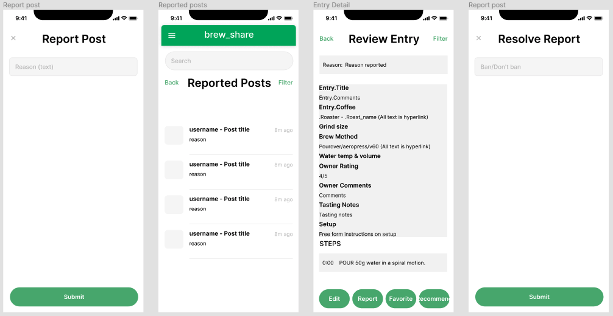
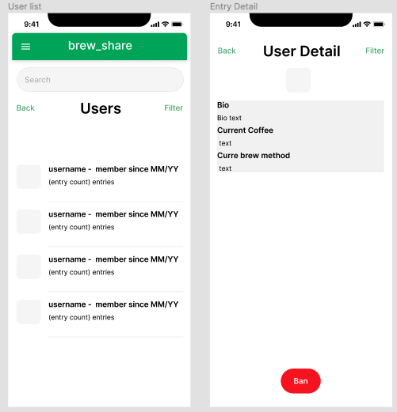

# brew_share
## Motive
1. Utilize and expand knowledge of REACT
1. Build a REACT client for an api I built from scratch

## What is brew__share?
brew_share is a digital coffee diary. Users can enter a coffee they've brewed, and the specific steps they followed. I enjoy trying different varieties of coffee, and have several different ways of brewing coffee (aeropress, chemex, single-serve pourover), but it can be hard to remember what combinations yielded the best results. brew_share aims to provide an easy place to journal your daily coffee. 

## Installation Instructions
Clone brew_share_client repository 
```
npm install
npm start 
```
### Server
Instructions for setting up a the local server for this app cna be found here: [brew_share_server](https://github.com/Daniel-L-Ross/brew_share).
## Features
* Add coffee varieties and brew methods to site
* Create, update, and delete entries
* Add detailed steps per entry along with photos
* Search publicly available entries

## Wireframe
### Login & Register


### Entries


### Coffee


### Brew Methods


## Support
Fill out a support ticket if you discover any major bugs to address. 

## Roadmap
Planned features include:
### Recipes & Recommend 


* This feature would allow users to convert their entries into "Recipes" for other users to review.
* Admin users would be able nominate recipes to be listed as "recommended"
* Recommended would be available as a search/filter option

### Report


* This feature would allow users to report posts if they believe the content is not appropriate for the brew_share platform. 
* Admin could resolve a report and choose to block the corresponding post so it does not show up in other users searches

### User list


* This feature would allow admin users to see details on all users in the system
* Admin could ban a user if they choose so they no longer have access to the system
 
## Contributing
Feel free to fork the repository and make pull requests. There is currently no plan to maintain this project, but I may work on it from time to time. 

## Acknowledgements

Special thanks to my project manager [Jayna Leitze](https://github.com/JaynaLeitze) for her guidance and encouragement to help get this project completed on time.  

## License
Open Source project. 
